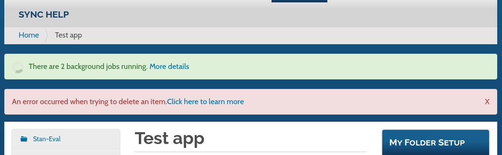
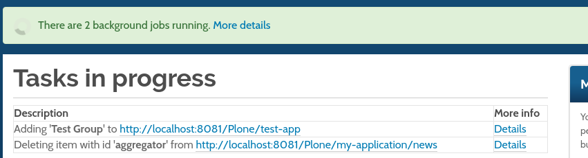
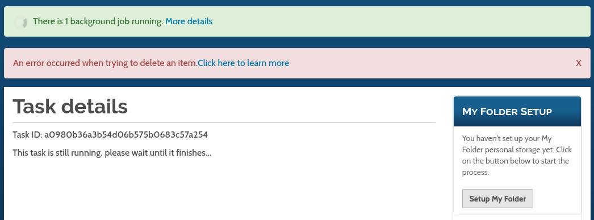
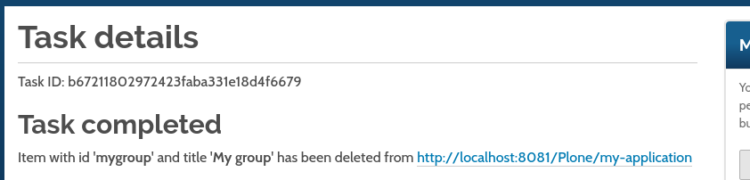
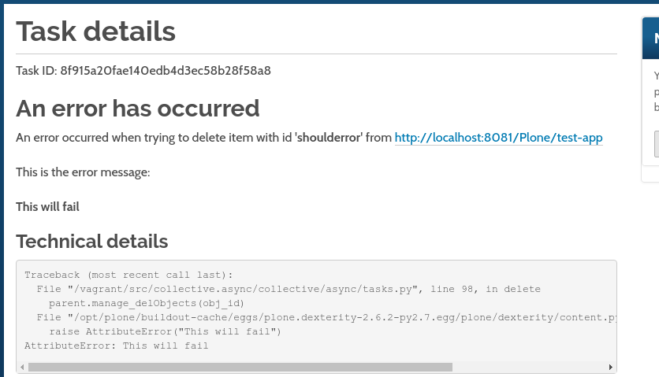

# collective.async
Table of contents
      How it was working
What was changed
A new viewlet
Task in progress page
Task details page
Automatic refresh of folder_contents table
Automatic full page refresh
Actions currently patched
Actions performed from the left toolbar
Actions performed from the folder_contents toolbar
Remains to be done

## How it was working
Some long running tasks, such as deleting content, were patched to instead be performed asynchronously using celery.
In a nutshell, when a long lasting task is executed by an editor, the following takes place:
1. From the Plone UI the editor clicks to fire an action (Say delete)
2. The patched Python code, instead of executing the requested action, will register a **task** with Celery and return
3. The editor is redirected to a **wait page** that will poll the server every 5 seconds.
4. Once the background task finishes, the editor is redirected back to the original location, it was supposed to go on step 2, if the code was not patched.

## What was changed
Most of the changes done to the async product were on the UI, almost nothing in the integration with Celery was changed on how it was implemented, other than adding a few extra values to the registered tasks.

### A new viewlet
Instead of redirecting back to a **wait page**, the implementation was refactored to include a viewlet with a banner that will show the number of tasks that are running in the background. With a link that will allow the editor to go to a **tasks in progress** page, with more information about which tasks are currently running, and what they are doing.
This viewlet will poll the server every 5 seconds to know the status of running tasks, whether they are still running, or if they are either completed or failed.
The viewlet will show the number of tasks currently being processed, or tasks that failed. Tasks that have successfully completed, are discarded. Tasks that have failed will persist in the banner, and they will show one below the other, until the editor dismisses them with the X to the right of the notification.

Example of 2 currently running tasks and a failed one:

### Task in progress page
The **tasks in progress** page will show the currently running tasks, with a brief description, and a link to get more information about a specific task.

### Task details page
As of now, the **task details** page is intended only to get more information about a task that has failed, in order for an editor to be able to get help from an administrator.

This is an example of how it looks like for a currently running task:

This is how it looks like for a task that has completed:

This is how it looks like for a task that has failed:

As it can be seen, when a task fails, it will show what the task was, what the error was, and at the bottom a full traceback of the error.

### Automatic refresh of folder_contents table
The table shown in the **folder_contents view**, is in fact a full Javascript app. When a task finishes successfully, the view of this table will automatically refresh, instead of reloading the full folder_contents page.

### Automatic full page refresh
When a task that was in a **processing** state completes successfully (ie. Celery returns its status as **success**), there are certain conditions under which the current page will be reloaded:

1. If the current page is the [Tasks in progress](#task-in-progress-page).
2. If the current page is the [Task details](#task-details-page) for the given task that has completed.
3. If the action was **Adding an item**, and the person is currently at the folder where this item is being added
4. If the action was **Renaming an item**, and the person is currently at either the content being renamed or its parent
5. If the action was **Deleting an item**, and the person is currently at the folder containing such item
6. If the action was **Pasting an item**, and the person is currently at the folder where the item is being pasted
7. If the action was **Editing an item**, and the person is currently at the item itself being edited, or if the person is at the folderish item containing the item, and the changes included changing the item’s title.

It is worth noting that if the current page is either an **Add** form or an **Edit** form, the page will never be refreshed

## Actions currently patched
### Actions performed from the left toolbar
1. Add an item
2. Edit an item
3. Rename an item
4. Delete an item
5. Paste an item

### Actions performed from the folder_contents toolbar
1. Delete an item
2. Paste an item

## Remains to be done
1. Adjust some of the default status messages Plone shows (e.g. When creating an item Plone shows a “Item was created”, this should be adjusted to something like “An item will be created”, or something in that sense).
2. Patch the “Rename item” from the folder_contents toolbar.
3. Move the patched views from afsoc.plone to collective.async (@@fc-delete and @@fc-paste)
4. Include entry points to each action that would allow to perform additional logic
5. Decide if we need to patch other long lasting actions (Workflow change, Sharing tab permissions, etc).
6. Add a timeout so if a task takes longer than X minutes, assume it failed
